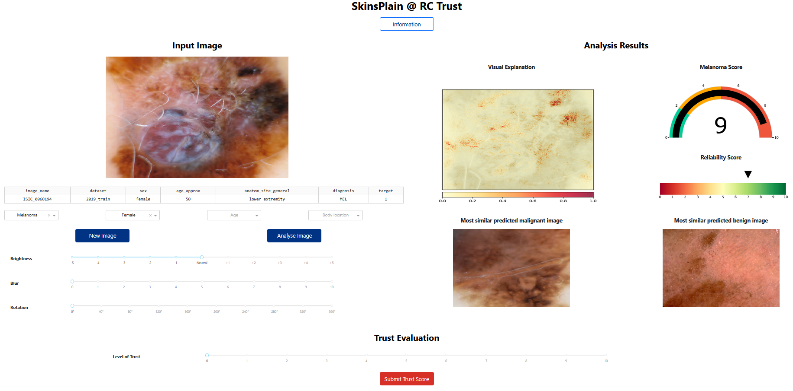

# SkinSplain: An XAI Framework for Trust Calibration in Skin Lesion Analysis



SkinSplain, is a web-based framework designed for measuring
users’ perceived trust in AI systems when interacting with both numerical and visual interpretability cues.

## Setup:
1. Run `data/setup.py` to download the image data
2. (Optionally) Unpack the segmentation images [*HAM10000_segmentations_lesion_tschandl.zip*](https://dataverse.harvard.edu/dataset.xhtml?persistentId=doi:10.7910/DVN/DBW86T#) into `data/segmentation_masks` directory
3. Install dependencies from `requirements.txt`, for example by creating a conda environment via:
```
conda env create -f env.yaml
```

## Run

- Run `src/main` in app.py to start the framework
- Check `src/main.py` for a minimal example of all relevant high-level XAI functionalities
- Check `src/training.py` for an example on how to train a new model

### Notes
- Computing the saliency map may take some time, if that's the case you can adjust the number of steps in `integrated_gradients.attribute()`
